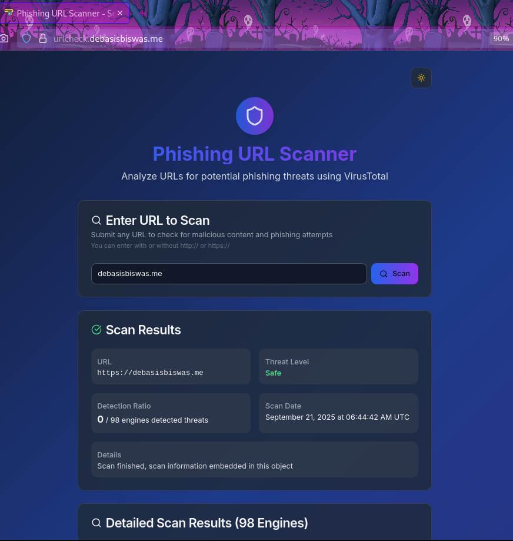

# Phishing URL Checker




[](https://app.netlify.com/projects/phishing-url-checkcer/deploys)

**Live Demo:** [urlcheck.debasisbiswas.me](https://urlcheck.debasisbiswas.me)

A modern web application to scan and detect phishing URLs. Built with Next.js, TypeScript, and Tailwind CSS.

## Features
- Scan URLs for phishing threats (powered by [VirusTotal API](https://docs.virustotal.com/docs/api-overview))
- Security policy API
- Responsive UI with modern components
- Built with Next.js, React, and Tailwind CSS


## API

This project uses the [VirusTotal API](https://docs.virustotal.com/docs/api-overview) to scan and analyze URLs for phishing and malicious content.

## Getting Started

### Prerequisites
- Node.js (v18 or later recommended)
- pnpm (or npm/yarn)

### Installation

1. Clone the repository:
   ```bash
   git clone https://github.com/DebaA17/Phishing-url-checker.git
   cd phishing-url
   ```
2. Install dependencies:
   ```bash
   pnpm install
   # or
   npm install
   # or
   yarn install
   ```
3. Run the development server:
   ```bash
   pnpm dev
   # or
   npm run dev
   # or
   yarn dev
   ```
4. Open [http://localhost:3000](http://localhost:3000) in your browser.

## Project Structure
- `app/` - Next.js app directory (pages, API routes)
- `components/` - Reusable UI components
- `hooks/` - Custom React hooks
- `lib/` - Utility functions
- `public/` - Static assets
- `styles/` - Global styles

## License

This project is licensed under the MIT License. See [LICENSE](LICENSE) for details.

---

Made with ❤️ by DEBASIS
